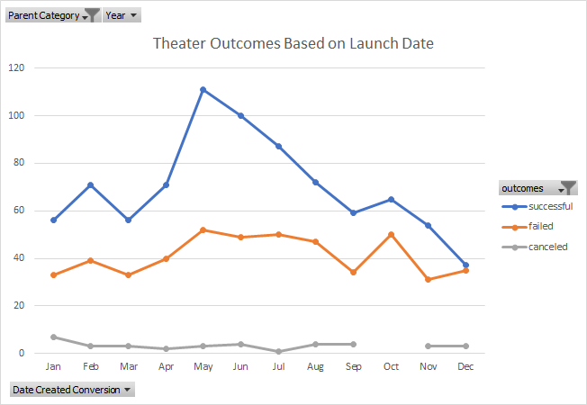
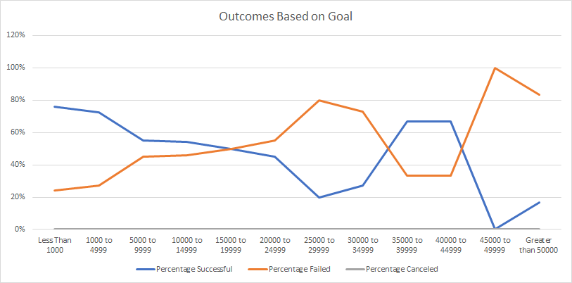

# Kickstarting with Excel

## Overview of Project

[Kickstarter](https://www.kickstarter.com/) has become a platform for many to receive not only funding, but the added bonus of exposure about the projects that they would like to see come into frutition. The data is a history of different Kickstarter campaigns.

### Purpose

Our client, Louise, who is coming close to reaching her fundraising goal for her play, *Fever* would like to figure out with the data provided about the following:
1. How different projects' outcomes (successful, failed, canceled) fared in terms of their launch dates
2. How the outcomes also fared based on their funding goals.
The main purpose of this project is to analyze the outcome of a kickstarter for plays based on the outcomes of their launch date as well as their funding goal. 
Another purpose is to also determine when a kickstarter for plays should be be launched as well as the goal amount that needs to be in order for the outcome of the project to be a success. This will be accomplisted by filtering the Kickstarter data given to us by focusing our main Parent category on Theater and subcategory Plays.

## Analysis and Challenges

### Analysis of Outcomes Based on Launch Date
According to the graph, there is a large outcome for success in the month of May for theater kickstarters; however, as the end of year approaches, the number of successful theater outcomes decreases dramatically. The number of failed theater kickstarters doesn't see a dramatic increase like the successful outcome, but there is an overall increase in the month of October. The data for canceled theater kickstarters suggests that there is a consistency throughout the year, although we do see a zero amout in the month of October. From the graph, we can conclude that the Spring/Summer season has a better success outcome for theater kickstarters, and as the year turns to Autumn/Winter the likelihood of success decreases.

### Analysis of Outcomes Based on Goals
At first glance, we can deduce that the percentage for canceled kickstarters for plays is 0. Next, we also see that kickstarters for plays have a 50-50 chance of success and failure for the goal amount between 15000-19999, and a 100% chance of failure for goal amount 45000-49999. Overall, we can see that there is a higher success outcome for projects that have a lower goal amount, but due to fewer kickstarters with a higher goal amount, this can also account for the higher success percentage as seen with the goal amounts 35000-39999 and 40000-44999.

### Challenges and Difficulties Encountered
I think my main issue was making sure I was following the directions for the challenge. I encountered problems early on when my pivot table for the Theater Outcomes Based on Launch Date was not matching the information found in the challenge. After looking at the main Kickstarter worksheet, I realized that needed to start over and redid the entire column for "Years." After this fix, everything started to align. Another challenge I encountered was Deliverable 2 for this challenge. My formula was incorrect, so I was getting wrong answers for the Number of Successful and Failed projects. I 

## Results

- What are two conclusions you can draw about the Outcomes based on Launch Date?
Based on the data drawn from the Outcomes Based on Launch Date, the first conclusion is that the peak for successful theater launches would be in the month of May. We can suggest to Louise that she should base the start of her play within the month of May due to the high success outcome for theater kickstarters. Another conclusion would be that the month of December would not be a good time for Louise to launch her play due to the low success outcome provided by the graph. 

- What can you conclude about the Outcomes based on Goals?
We can assume that it is probably in the best interest of the individual to have a lower goal amount for their kickstarter to have a successful outcome. 

- What are some limitations of this dataset?
Overall, I believe the dataset in its entirety is cannot be a full representation of the population of the Kickstarters campaigns. The first entry for the data was from 2009, so I'm not entirely convinced that a span of 11 years would be enough data to collect. There is also the case that failed Kickstarters could have the potential to be re-launched at a later date, resulting in data that may not actually be representative of the dataset we were given. This could be the reason why the outcome for the Kickstarters is higher than what may be normal. 
I think due to the smaller sample size of just focusing on the "Plays" subcategory, a further analysis should be done about how large or small the production size was for these plays. Due to the higher costs of hiring more people, equipment, venue, etc. this could have also played a part into why the outcome for a particular Kickstarter was successful or failed. There was also zero cancelations for the "Plays" subcategory.

- What are some other possible tables and/or graphs that we could create?
1. The average length of time the Kickstarter campaign was online would have affected the outcome; would having a longer time to fundraise contribute to a Kickstarter's likelihood of becoming successful, failing, getting canceled, etc.
2. Whether or not a "successful" Kickstarter has remained successful
3. Relaunching failed Kickstarters and whether the changes made helped change the outcome of the campaign
